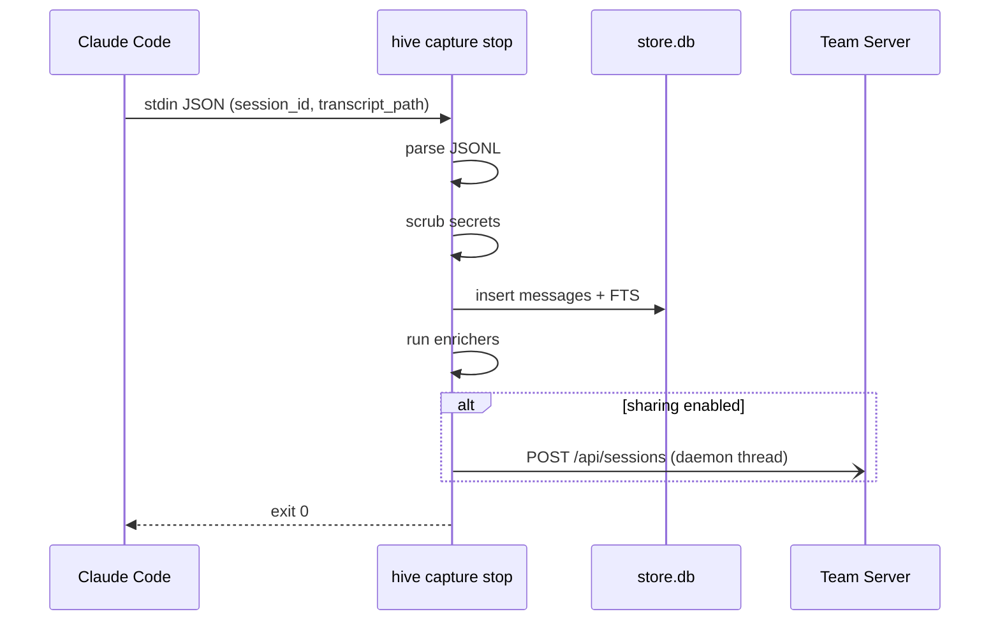

# Capture Layer

The capture layer ingests AI coding sessions from external tools and normalizes them into hive's storage schema. It is the entry point for all data flowing into the system.

## Quick Example

```bash
# Claude Code fires a hook event on stdin:
echo '{"session_id": "abc-123", "project_path": "/my/project"}' | hive capture SessionStart

# On session end, the transcript is parsed and stored:
echo '{"session_id": "abc-123", "transcript_path": "/path/to/abc-123.jsonl"}' | hive capture Stop
```

## CaptureAdapter Protocol

Every capture adapter implements the ABC defined in `src/hive/capture/base.py`:

```python
class CaptureAdapter(ABC):
    def name(self) -> str: ...       # stable identifier, e.g. "claude_code"
    def setup(self) -> None: ...     # one-time init (idempotent)
    def handle(self, event_name: str, data: dict) -> None: ...  # process a hook event
```

!!! info "Extensibility"
    The protocol is designed for future adapters (Cursor, Copilot, etc.). Each adapter translates tool-specific events into the shared hive schema. Unknown events are silently ignored.

## ClaudeCodeAdapter

The primary adapter handles four Claude Code hook events:

| Event | Trigger | Action |
|-------|---------|--------|
| `SessionStart` | New conversation begins | Creates session row, records git state (branch, commit, remote) |
| `Stop` | Conversation ends | Parses JSONL transcript, inserts messages, runs enrichers, auto-pushes |
| `PostToolUse` | After Read/Write/Edit/Bash | Creates `session->file` edges with "touched" relationship |
| `PreCompact` | Before context compaction | Snapshots full transcript as an enrichment before Claude truncates it |

### Hook Installation

Claude Code hooks are configured in `.claude/settings.json`. Running `hive init` registers hive as a hook handler so that Claude Code sends events to `hive capture <event>` on stdin as JSON.

### Stop Hook Sequence

The `Stop` event does the heaviest lifting -- parsing, scrubbing, enriching, and optionally pushing to the team server:



## Transcript Parsing

Claude Code writes session transcripts as JSONL files. Each line is a JSON object with fields like `type`, `message`, `isMeta`, and `timestamp`.

The parser (`_parse_jsonl`) applies several transformations:

1. **Filters** -- Only `user` and `assistant` record types are kept. Meta/system messages (`isMeta: true`) are skipped.
2. **Role normalization** -- The `user` role is mapped to `human`; `tool_result` and `tool_use` become `tool`.
3. **Content extraction** -- Handles both plain string content and structured content block lists (text, tool_use, tool_result, thinking).
4. **Secret scrubbing** -- Every message's content is passed through `scrub()` before storage. Regex patterns are loaded from `scrub_patterns.toml` and user config.

!!! warning "Double Scrub"
    Secrets are scrubbed twice: once during JSONL parsing (per-message) and again on the concatenated FTS content before indexing. This ensures no secret leaks into either the messages table or the full-text search index.

## Summary Derivation

The session summary is derived from the **first meaningful human message**. The algorithm skips:

- Slash-command messages (e.g., `<command-name>/...`)
- XML-wrapped command messages
- Tool result messages
- Messages shorter than 5 characters after stripping XML tags

The selected message is truncated to 120 characters.

## Auto-Push on Stop

When sharing is enabled for a project (via `.hive/config.toml`), the adapter pushes the session to the team server immediately after the Stop event:

1. Export the full session payload via `QueryAPI.export_session()`
2. Run `scrub_payload()` for an additional round of secret redaction
3. Fire `POST /api/sessions` in a **daemon thread** so the hook returns instantly

!!! note "Fire and Forget"
    The daemon thread means Claude Code's hook exits with code 0 immediately. If the push fails (server down, network error), the failure is logged at debug level and silently dropped. The session remains safely in the local store.

## Git Post-Commit Hook

The `GitCommitHook` class in `src/hive/capture/git_hook.py` links git commits to sessions. It runs as a `.git/hooks/post-commit` script.

**How it works:**

1. Read the HEAD commit SHA and changed file list from git
2. Find the most recently ended session within the `link_window_minutes` window (default: 30 minutes)
3. Create edges: `session -> commit` (relationship: "produced") and `session -> file` (relationship: "committed") for each changed file

```bash
# Install the hook into a repo
hive init --git-hook /path/to/repo

# The generated hook script:
#!/usr/bin/env bash
if command -v hive &>/dev/null; then
    hive hook post-commit &
fi
```

The hook appends to existing post-commit scripts rather than replacing them, and skips installation if hive is already present. The `&` runs it in the background so `git commit` returns immediately.
