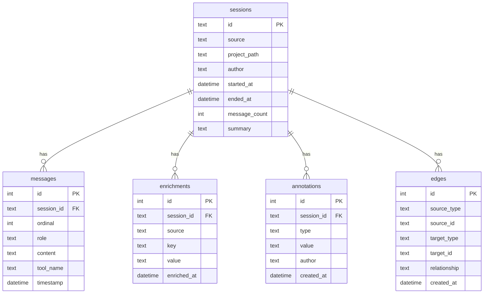

# Data Model

Hive stores all data in SQLite across 6 tables. This page documents every table, column, constraint, and the relationships between them.

## Entity-Relationship Diagram

## Tables

### sessions

The central table. One row per AI coding session.

| Column | Type | Constraints | Description |
|--------|------|-------------|-------------|
| `id` | TEXT | PRIMARY KEY | UUID assigned by Claude Code |
| `source` | TEXT | NOT NULL | Adapter name (e.g., `claude_code`) |
| `project_path` | TEXT | | Absolute path to the project directory |
| `author` | TEXT | | Git `user.name` of the developer |
| `started_at` | DATETIME | | ISO-8601 timestamp of session start |
| `ended_at` | DATETIME | | ISO-8601 timestamp of session end |
| `message_count` | INTEGER | DEFAULT 0 | Total messages in the conversation |
| `summary` | TEXT | | First meaningful human message (truncated to 120 chars) |

**Indexes:** `idx_sessions_project` on `project_path`, `idx_sessions_started` on `started_at`.

### messages

Individual conversation turns within a session, ordered by `ordinal`.

| Column | Type | Constraints | Description |
|--------|------|-------------|-------------|
| `id` | INTEGER | PRIMARY KEY AUTOINCREMENT | Row ID |
| `session_id` | TEXT | NOT NULL, FK -> sessions(id) | Parent session |
| `ordinal` | INTEGER | NOT NULL | 1-based position in the conversation |
| `role` | TEXT | NOT NULL, CHECK IN ('human', 'assistant', 'tool') | Speaker role |
| `content` | TEXT | | Message text (secrets scrubbed) |
| `tool_name` | TEXT | | Tool name if this is a tool-use message |
| `timestamp` | DATETIME | | When the message was sent |

**Index:** `idx_messages_session` on `session_id`.

!!! note "Role Normalization"
    Claude Code uses `user` for human messages. Hive normalizes this to `human` during capture. The `tool` role covers both `tool_use` (assistant calling a tool) and `tool_result` (tool output).

### enrichments

Key-value metadata produced by enrichers or the capture adapter.

| Column | Type | Constraints | Description |
|--------|------|-------------|-------------|
| `id` | INTEGER | PRIMARY KEY AUTOINCREMENT | Row ID |
| `session_id` | TEXT | NOT NULL, FK -> sessions(id) | Parent session |
| `source` | TEXT | NOT NULL | Enricher name (e.g., `git`, `quality`, `tokens`) |
| `key` | TEXT | NOT NULL | Metric name (e.g., `branch`, `message_count`) |
| `value` | TEXT | | The value (always stored as text) |
| `enriched_at` | DATETIME | DEFAULT datetime('now') | When the enrichment was created |

**Indexes:** `idx_enrichments_session` on `session_id`, `idx_enrichments_key` on `(session_id, key)`.

### annotations

User-created labels for sessions: tags, comments, and ratings.

| Column | Type | Constraints | Description |
|--------|------|-------------|-------------|
| `id` | INTEGER | PRIMARY KEY AUTOINCREMENT | Row ID |
| `session_id` | TEXT | NOT NULL, FK -> sessions(id) | Parent session |
| `type` | TEXT | NOT NULL, CHECK IN ('tag', 'comment', 'rating') | Annotation kind |
| `value` | TEXT | NOT NULL | The tag name, comment text, or rating value |
| `author` | TEXT | | Who created the annotation |
| `created_at` | DATETIME | DEFAULT datetime('now') | When the annotation was created |

**Index:** `idx_annotations_session` on `session_id`.

### edges

Typed graph relationships linking sessions to files, commits, and other entities. This is the foundation of hive's lineage tracking.

| Column | Type | Constraints | Description |
|--------|------|-------------|-------------|
| `id` | INTEGER | PRIMARY KEY AUTOINCREMENT | Row ID |
| `source_type` | TEXT | NOT NULL | Entity type of the source (e.g., `session`) |
| `source_id` | TEXT | NOT NULL | ID of the source entity |
| `target_type` | TEXT | NOT NULL | Entity type of the target (e.g., `file`, `commit`) |
| `target_id` | TEXT | NOT NULL | ID of the target entity (file path or commit SHA) |
| `relationship` | TEXT | NOT NULL | Edge label (see below) |
| `created_at` | DATETIME | DEFAULT datetime('now') | When the edge was created |

**Indexes:** `idx_edges_source` on `(source_type, source_id)`, `idx_edges_target` on `(target_type, target_id)`.

#### Edge Types

| Source | Target | Relationship | Meaning |
|--------|--------|-------------|---------|
| `session` | `file` | `touched` | Session read or wrote this file (via PostToolUse hook) |
| `session` | `file` | `committed` | Session's associated git commit changed this file |
| `session` | `commit` | `produced` | Session was active when this commit was made |

!!! info "Why Edges Instead of Foreign Keys?"
    The edges table uses a generic graph model rather than dedicated FK columns. This allows new relationship types (e.g., `session -> PR`, `session -> issue`) to be added without schema migrations.

### sessions_fts

FTS5 virtual table for full-text search.

| Column | Type | Description |
|--------|------|-------------|
| `session_id` | TEXT | Links to sessions(id) |
| `content` | TEXT | Concatenated, scrubbed message content |

Configured with `tokenize='porter'` for stemmed search. Supports FTS5's `MATCH` syntax and `snippet()` for highlighted results.
