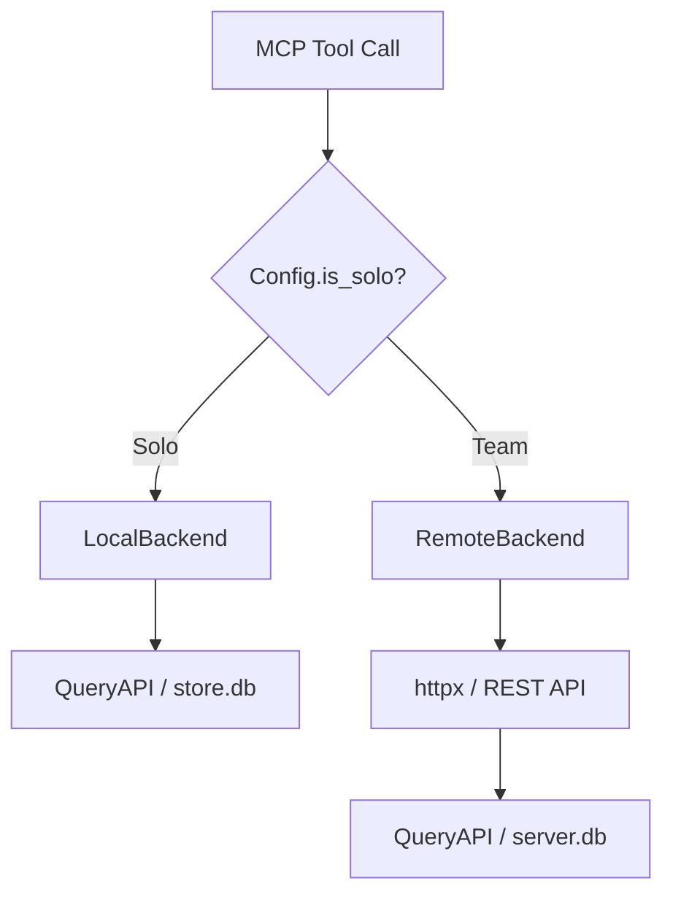
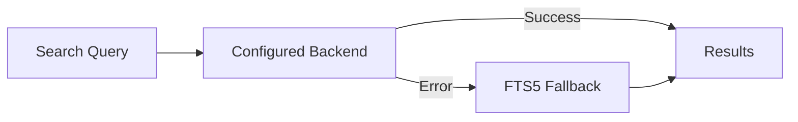

# Design Decisions

This page documents the key architectural choices in hive, the reasoning behind them, and their trade-offs.

## 1. SQLite over Postgres

**Decision:** Use SQLite for both local and server storage.

**Reasoning:** SQLite is perfect for the MVP. It is local-first, requires zero configuration, and the entire database is a single file that can be backed up with `cp`. WAL mode provides good concurrent read performance, and FTS5 delivers full-text search out of the box.

For teams of roughly 50 developers, SQLite handles the write load comfortably -- sessions are written infrequently (one per conversation) and reads are lightweight queries. A single `server.db` file on a shared host serves the team without any database infrastructure.

!!! note "Future Direction"
    A Postgres backend is on the roadmap for larger teams that need concurrent writes from hundreds of clients, replication, or integration with existing database infrastructure.

## 2. Scrub on the Client

**Decision:** Redact secrets **before** data leaves the developer's laptop.

**Reasoning:** AI coding sessions frequently contain API keys, tokens, and credentials pasted into prompts or printed in tool output. By scrubbing on the client side, secrets never hit the network or the team server, even if TLS is misconfigured or the server is compromised.

The scrub pipeline runs twice:

1. **During JSONL parsing** -- each message's content is passed through `scrub()` before being written to `store.db`
2. **Before push** -- the full export payload is scrubbed again via `scrub_payload()` before `POST` to the server

Regex patterns are loaded from the shipped `scrub_patterns.toml` and are configurable per user. Patterns can be disabled or extended via `~/.config/hive/config.toml`.

!!! warning "Defense in Depth"
    The double scrub is intentional. Enrichers may produce new content after the first scrub, and export serialization might expose fields that were not scrubbed at parse time.

## 3. MCP Reads from REST, Not SQLite Directly

**Decision:** The MCP server uses a backend protocol that abstracts data access.

**Reasoning:** By routing through the REST API, the MCP server behaves identically whether it is connected to a localhost server or a remote team server. Developers get the same tool results regardless of deployment topology.

In solo mode (PR #6), the MCP server now also supports a `LocalBackend` that reads directly from `store.db` via `QueryAPI`. This eliminates the need to run `hive serve` for individual developers while preserving the same interface.

## 4. Daemon Thread Push

**Decision:** Auto-push sessions to the team server in a daemon thread.

**Reasoning:** Claude Code hooks must return quickly. If the `Stop` hook blocked on an HTTP request to the team server, it would add latency to every conversation end. Worse, a server timeout would make the hook fail.

The daemon thread fires off the `POST /api/sessions` request and exits. Because it is a daemon thread, it is killed when the main process exits -- but by that point the HTTP request is either in flight or completed.

!!! info "Trade-off"
    Failed pushes are silently dropped (logged at `DEBUG` level). This is acceptable because the session is always safely stored locally. Users can manually push with `hive push <session_id>` if the auto-push failed.

## 5. Edges Graph for Lineage

**Decision:** Use a generic typed-edges table instead of dedicated foreign key columns for relationships.

**Reasoning:** Hive tracks several kinds of relationships: sessions touch files, sessions produce commits, commits change files. Rather than adding FK columns to sessions for each relationship type, the `edges` table stores typed `(source_type, source_id) -> (target_type, target_id)` pairs with a `relationship` label.

This design supports:

- **New relationship types** without schema migrations (e.g., `session -> PR`, `session -> issue`)
- **Bidirectional queries** -- find all sessions for a file, or all files for a session
- **Graph traversal** -- walk multi-hop paths (file -> session -> commit -> session -> file)

Current edge types:

| Relationship | Meaning |
|-------------|---------|
| `touched` | Session read/wrote a file during tool use |
| `committed` | A git commit associated with the session changed this file |
| `produced` | Session was active when the commit was made |

## 6. Idempotent Setup

**Decision:** All setup operations are safe to run repeatedly.

**Reasoning:** Developers run `hive init` when onboarding, and it may be invoked again when updating or troubleshooting. Hook installation checks for existing hive entries before modifying scripts. Database tables use `CREATE TABLE IF NOT EXISTS`. Session imports use `ON CONFLICT` upserts or clear-then-insert patterns.

This means:

- Running `hive init` twice produces the same result as running it once
- Pushing the same session twice overwrites cleanly via `import_session`
- Installing the git hook into a repo that already has it is a no-op

## 7. Pluggable Search Backends

**Decision:** Abstract search behind an ABC with a factory function, supporting multiple implementations.

**Reasoning:** Different deployment scenarios need different search capabilities:

| Backend | Best For | Requires |
|---------|----------|----------|
| `sqlite-vec` | Solo developers, small teams | Nothing (in-process) |
| `witchcraft` | Teams needing semantic search | External `hive-search` binary |
| FTS5 fallback | Guaranteed availability | Nothing (built into SQLite) |

The search flow tries the configured backend first and falls back to FTS5 on any error. This ensures search always works, even if the vector database is corrupted or the external server is down.

!!! tip "Configuration"
    Set `search.backend` in `~/.config/hive/config.toml` to `sqlite-vec`, `witchcraft`, or `fts5`. The default is `sqlite-vec`.
