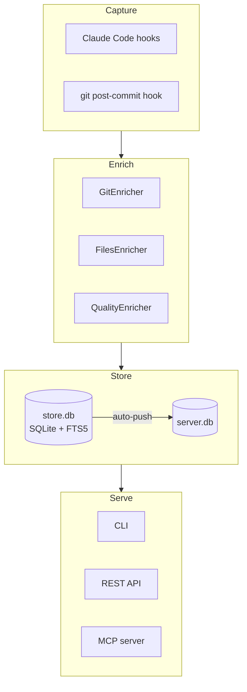
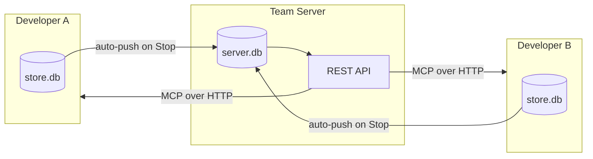

# Architecture Overview

hive uses a four-layer pipeline to turn raw AI coding sessions into searchable, shareable team knowledge.

## Four-Layer Pipeline

| Layer | Components | Responsibility |
|-------|-----------|----------------|
| **Capture** | Claude Code hooks, git post-commit | Ingest raw session data from stdin JSON |
| **Enrich** | Git, Files, Quality enrichers | Attach derived metadata (branch, files, quality signals) |
| **Store** | SQLite + FTS5 (`store.db`, `server.db`) | Persist sessions, messages, enrichments, edges |
| **Serve** | CLI, REST API, MCP server | Query and expose data to humans and AI |

## Solo vs Team Mode

!!! info "Solo mode (default)"
    Everything stays local. The CLI reads and writes `store.db` directly.
    The MCP server talks to `localhost:3000` which reads from `server.db`.

!!! info "Team mode"
    Enable per-project sharing with `hive config sharing on`. When a session
    ends (`Stop` hook), the adapter scrubs secrets from the full payload and
    POSTs it to the configured `server_url` via a daemon thread. Team members
    run `hive serve` to host a shared server with its own `server.db`.

Transitioning from solo to team is one config change -- the `server_url`.

## Two Databases

| Database | Path | Purpose |
|----------|------|---------|
| `store.db` | `~/.local/share/hive/store.db` | Local session data. Written by capture adapters and enrichers. Read by CLI commands. |
| `server.db` | `~/.local/share/hive/server.db` | Team server data. Written by the REST API `POST /api/sessions`. Read by the REST API and MCP server. |

Both use the same schema: `sessions`, `messages`, `enrichments`, `annotations`, `edges`, and `sessions_fts` (FTS5).

## Key Design Decisions

!!! abstract "1. Scrub on the client"
    Secrets are redacted using regex patterns _before_ data leaves the local
    machine. The `scrub()` function runs during JSONL parsing (content) and
    again via `scrub_payload()` before any push to the server. Patterns are
    configurable in `config.toml`.

!!! abstract "2. MCP reads from REST, not SQLite"
    The MCP server uses `httpx` to call the REST API rather than importing the
    SQLite layer. This means it works identically against localhost (solo) or a
    remote team server -- just change `server_url`. In solo mode, it can also
    read directly from local SQLite when no server is running.

!!! abstract "3. Daemon thread push"
    Auto-push to the team server happens in a `threading.Thread(daemon=True)`
    so the Claude Code hook returns immediately. If the push fails, it is
    silently dropped (logged at debug level).

!!! abstract "4. Edges graph for lineage"
    File and commit relationships are stored as typed edges
    (`session -> file`, `session -> commit`) rather than columns, enabling
    flexible lineage queries without schema changes.

!!! abstract "5. Idempotent setup"
    `hive init` and all hook installations are safe to run repeatedly. Hooks
    check for existing entries before adding. Session import uses
    `ON CONFLICT` upserts and clears-then-reinserts for re-pushes.

## Database Schema

| Table | Purpose |
|-------|---------|
| `sessions` | Session metadata (id, source, project, author, timestamps, summary) |
| `messages` | Individual messages (role, content, tool_name, ordinal, timestamp) |
| `enrichments` | Key-value context from enrichers (source, key, value) |
| `annotations` | User-applied metadata (tags, comments, ratings) |
| `edges` | Lineage graph (source_type/id to target_type/id + relationship) |
| `sessions_fts` | FTS5 full-text search index |

## Tech Stack

**Backend**: Python 3.11+, Click, FastAPI, SQLAlchemy 2.0, Alembic, SQLite (WAL mode), MCP SDK, httpx
