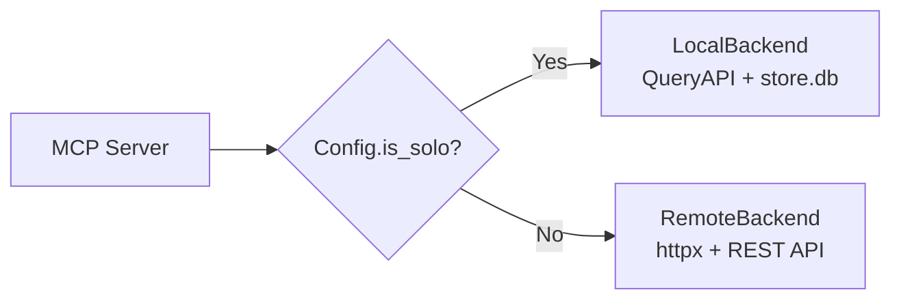

# Serve Layer

The serve layer exposes hive's data through three interfaces: a CLI for humans, a REST API for machines, and an MCP server for AI assistants.

## Quick Example

=== "CLI"
    ```bash
    hive search "auth refactor" --project my-app
    hive show abc-123 --messages
    hive stats --group-by project
    ```

=== "REST API"
    ```bash
    curl http://localhost:3000/api/search?q=auth+refactor
    curl http://localhost:3000/api/sessions/abc-123?detail=messages
    curl http://localhost:3000/api/stats?group_by=project
    ```

=== "MCP"
    ```json
    {"tool": "search", "arguments": {"query": "auth refactor", "project": "my-app"}}
    ```

## CLI (Click + Rich)

The CLI is built with Click for command parsing and Rich for formatted terminal output. Source: `src/hive/cli.py`.

| Command | Description |
|---------|-------------|
| `hive init` | Initialize hive data directory and install hooks |
| `hive serve` | Start the REST API server |
| `hive search <query>` | Full-text search across sessions |
| `hive show <session_id>` | Display session details |
| `hive log` | List recent sessions |
| `hive lineage <file>` | Show which sessions touched a file |
| `hive stats` | Aggregated statistics |
| `hive tag <session_id> <tag>` | Add a tag annotation |
| `hive delete <session_id>` | Remove a session |
| `hive push <session_id>` | Push a session to the team server |

## REST API (FastAPI)

The REST API is built with FastAPI and serves as both the team server endpoint and the backing store for the MCP server in team mode. Source: `src/hive/serve/api.py`.

```bash
hive serve --port 3000
# Interactive API docs at http://localhost:3000/api/docs
```

### Endpoints

| Method | Path | Description |
|--------|------|-------------|
| `GET` | `/` | Health check |
| `GET` | `/api/sessions` | List sessions with filters (project, author, date range, tags, tokens, model) |
| `POST` | `/api/sessions` | Import a pushed session payload |
| `GET` | `/api/sessions/{id}` | Get session detail |
| `DELETE` | `/api/sessions/{id}` | Delete a session (cascading) |
| `GET` | `/api/search` | Full-text search with snippets |
| `GET` | `/api/lineage/{path}` | File lineage graph |
| `GET` | `/api/stats` | Aggregated statistics |
| `GET` | `/api/projects` | List all projects |
| `POST` | `/api/annotations` | Create tag/comment/rating |

!!! warning "CORS Configuration"
    CORS is wide open (`allow_origins=["*"]`) for local development. For production deployments, restrict origins to your team's domains.

## MCP Server

The MCP server exposes hive data to AI assistants over stdio transport. It provides 6 tools. Source: `src/hive/mcp_server.py`.

```bash
# Start MCP server
hive mcp
```

### Tools

| Tool | Description | Required Args |
|------|-------------|---------------|
| `search` | Full-text search across sessions | `query` |
| `get_session` | Retrieve session with messages and enrichments | `session_id` |
| `lineage` | File lineage -- every session that touched a file | `file_path` |
| `recent` | List recent sessions with optional filters | (none) |
| `stats` | Aggregated statistics with optional grouping | (none) |
| `delete` | Delete a session and all related data | `session_id` |

### Backend Selection

The MCP server uses a backend protocol (`HiveBackend`) with two implementations:



=== "Solo Mode (LocalBackend)"
    When `server_url` points to localhost (the default), the MCP server reads directly from `store.db` via `QueryAPI`. No running server required. This is the typical setup for individual developers.

=== "Team Mode (RemoteBackend)"
    When `server_url` points to a remote host, the MCP server proxies all requests to the REST API using `httpx`. This gives every team member's AI assistant access to the shared session history.

**Automatic detection:** The `Config.is_solo` property checks if `server_url`'s hostname is `localhost`, `127.0.0.1`, or `::1`. No manual configuration needed for solo mode.

!!! tip "Solo Mode Advantage"
    Solo mode (introduced in PR #6) eliminates the need to run `hive serve` just to use MCP tools locally. Your AI assistant can query session history directly from the SQLite database.

### Error Handling

The MCP server catches `httpx.ConnectError` (server unreachable) and `httpx.HTTPStatusError` (server errors) and returns them as structured JSON error responses rather than crashing. In solo mode, errors from `QueryAPI` are returned similarly.
