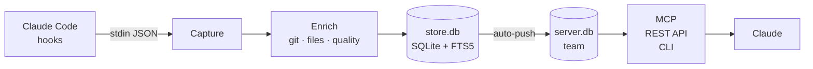

---
hide:
  - navigation
  - toc
---

# **Hive** remembers every session you ship.

Every Claude Code run, every Claude Desktop thread — captured to one searchable history. Solo by default, your team when you're ready.

[Get started :material-arrow-right:](getting-started/index.md){ .md-button .md-button--primary }
[View on GitHub :fontawesome-brands-github:](https://github.com/sabre-ai/hive){ .md-button }

## What Hive does

- :material-record-rec:{ .lg .middle } __Session capture__

    ---

    Claude Code SessionStart / SessionEnd hooks persist prompts, tool calls, and outputs to a local store. Nothing to configure per-session.

    `claude-code · hooks`

- :material-robot-outline:{ .lg .middle } __MCP surface__

    ---

    Both capture and query happen over MCP. Claude Desktop reads and writes to the same store as Code through a single server endpoint.

    `claude-desktop · mcp`

- :material-server-network:{ .lg .middle } __Self-hosted team mode__

    ---

    `hive serve` exposes the store over HTTP. SQLite-backed, Apache 2.0, no SaaS dependency. Secret scrubbing runs before any write crosses the wire.

    `hive serve · sqlite`

- :material-source-branch:{ .lg .middle } __Git-aware indexing__

    ---

    Sessions are tagged with branch, commit, and PR number. Queries can be filtered by any of these; lineage survives rebases.

    `branch · commit · pr`

## How it works

## Get involved

- [Contributing](contributing.md) — adapters, enrichers, and more
- [Security](security.md) — how we handle secrets
- [GitHub](https://github.com/sabre-ai/hive) — issues, discussions, PRs welcome

**Apache 2.0** — self-host, fork, audit. The server, the scrubber, and the MCP surface are all in-repo.
