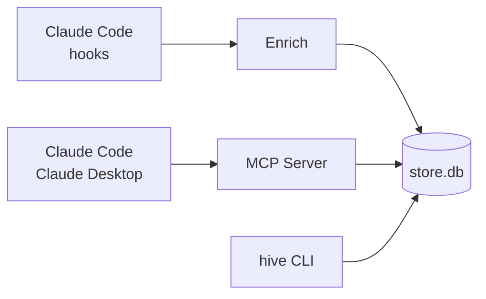

---
hide:
  - navigation
  - toc
---

# All your AI sessions in one searchable history.

Every Claude Code run, every Claude Desktop thread — captured to one searchable history. Solo by default, your team when you're ready.

[Get started :material-arrow-right:](getting-started/index.md){ .md-button .md-button--primary }
[View on GitHub :fontawesome-brands-github:](https://github.com/sabre-ai/hive){ .md-button }

## What Hive does

- :material-record-rec:{ .lg .middle } __Automatic cross-tool capture__

    ---

    Claude Code and Claude Desktop conversations in one history, no setup per-session. Prompts, tool calls, and outputs are preserved automatically.

- :material-magnify:{ .lg .middle } __Searchable by Claude__

    ---

    Ask Claude about past decisions, designs, and debugging context across your full history. Full-text and semantic search via MCP.

- :material-arrow-expand-all:{ .lg .middle } __Solo to team__

    ---

    Works on your laptop, scales to a shared server when you're ready. SQLite or PostgreSQL, self-hosted, Apache 2.0.

## How it works

See [Architecture](architecture/overview.md) for the full pipeline including team mode.

## Get involved

- [Contributing](contributing.md) — adapters, enrichers, and more
- [Security](security.md) — how we handle secrets
- [GitHub](https://github.com/sabre-ai/hive) — issues, discussions, PRs welcome

**Apache 2.0** — self-host, fork, audit. The server, the scrubber, and the MCP surface are all in-repo.
