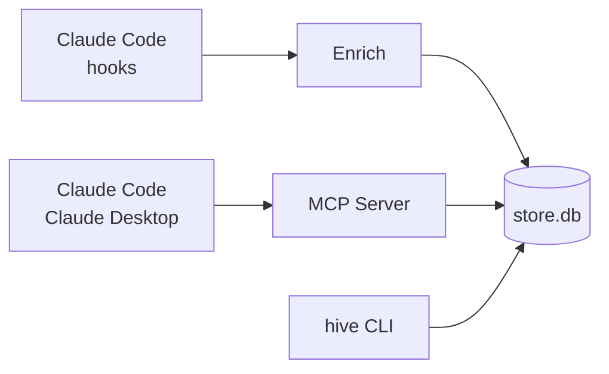

---
hide:
  - navigation
  - toc
---

# Team Layer for Claude.

↳ so Claude can answer

› <em>"Has anyone on the team built this before?"</em> 
› <em>"What worked when Alice hit this last week?"</em> 
› <em>"Why did we choose this architecture?"</em>

Every Claude Code and Claude Desktop session across your team — now Claude's working context.

  <code class="hive-install__cmd">
    $curl&nbsp;https://sabre-ai.github.io/hive/install.sh&nbsp;|&nbsp;bash
  </code>
  <button
    class="hive-install__copy"
    type="button"
    data-hive-copy="curl https://sabre-ai.github.io/hive/install.sh | bash"
    aria-label="Copy install command">COPY</button>

[Read the Docs :material-arrow-right:](getting-started/index.md){ .md-button .md-button--primary }
[View on GitHub :fontawesome-brands-github:](https://github.com/sabre-ai/hive){ .md-button }

## What you get

- :material-magnify:{ .lg .middle } __Skip the duplicate work__

    ---

    Search across teammate sessions before starting yours.

- :material-account-group:{ .lg .middle } __Onboard new teammates faster__

    ---

    They get the team's prompt history on day one.

- :material-file-document-check:{ .lg .middle } __Stop re-deriving decisions__

    ---

    Every "why did we..." has a transcript attached.

## How it works

See [Architecture](architecture/overview.md) for the full pipeline including team mode.

## Get involved

- [Contributing](contributing.md) — adapters, enrichers, and more
- [Security](security.md) — how we handle secrets
- [GitHub](https://github.com/sabre-ai/hive) — issues, discussions, PRs welcome

**Apache 2.0** — self-host, fork, audit. The server, the scrubber, and the MCP surface are all in-repo.
