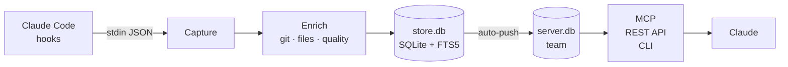

---
hide:
  - navigation
  - toc
---

<div class="hive-hero" markdown>

# Your team's AI coding history, searchable by Claude

Hive captures every Claude Code session from every developer, enriches each one with git and file context, and makes the team's collective history available through MCP — so Claude can answer *"how did we solve this last time?"*

[Get started :material-arrow-right:](getting-started/quickstart.md){ .md-button .md-button--primary }
[View on GitHub :fontawesome-brands-github:](https://github.com/sabre-ai/hive){ .md-button }

</div>

## Why hive?

<div class="grid cards" markdown>

- :material-record-rec:{ .lg .middle } __Capture automatically__

    ---

    Claude Code hooks record every session into local SQLite. Zero effort per session.

- :material-account-group:{ .lg .middle } __Share with your team__

    ---

    One config flip auto-pushes sessions to a shared server. Client-side secret scrubbing means nothing sensitive leaves the laptop.

- :material-robot-outline:{ .lg .middle } __Queryable via Claude__

    ---

    Hive is a first-class MCP server. Ask Claude *"what did we decide about auth?"* and it searches the team's history.

- :material-source-branch:{ .lg .middle } __Git-aware lineage__

    ---

    Every session links to the commits it produced and the files it touched. Walk the graph from a file back to the conversation that created it.

</div>

## Quickstart

=== "Solo mode"

    ```bash
    pipx install hive-team
    cd your-project
    hive init
    hive serve
    ```

=== "Team mode"

    ```bash
    # On each developer's machine
    pipx install hive-team
    hive init
    hive config sharing on
    claude mcp add --scope user --transport stdio hive -- hive mcp
    ```

    See [Team Mode → Server Setup](team-mode/server-setup.md) for the server side.

## How it works



## Get involved

- [Roadmap](roadmap.md) — what's coming next
- [Contributing](contributing.md) — how to add an enricher or capture adapter
- [Security](security.md) — how we handle secrets
